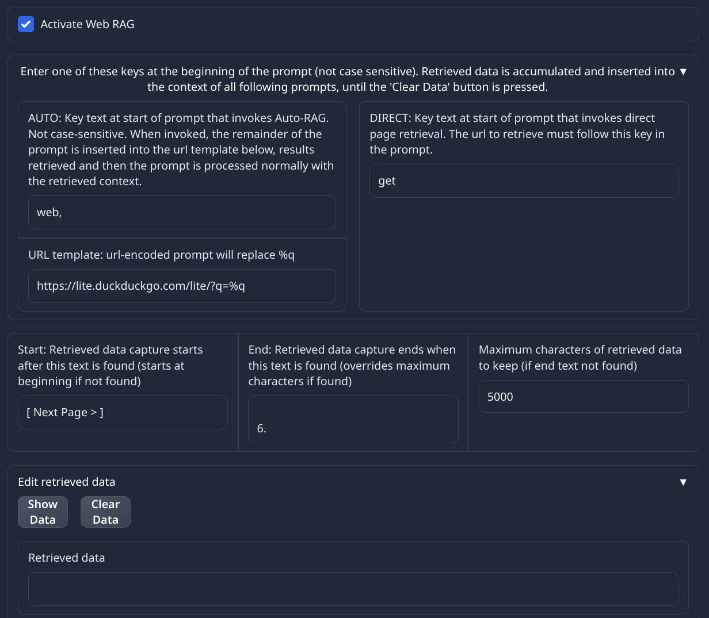

****Web RAG -- Retrieval-Augmented Generation from Web content****

***An extension for Oobabooga's Text-Generation Web UI***
* This extension requires that the 'links' browser be installed. It should be available in your package manager.
* I have only tested on Linux. I'm open to PRs to make the links integration work on other platforms.

There are two kinds of retrieval: Manual and Auto.

Manual -- Enter the key text (default is 'get') followed by a URL. It will be retrieved and added to the context of all further prompts.
 * You: get https://www.sciencedaily.com/releases/2024/01/240123175550.htm
 * AI: Retrieved 5000 characters. Total is 5000.
 * You: How does gravity help study the strong force?
 * AI: Gravity helps study the strong force by connecting theories of gravitation to interactions among the smallest particles of matter, as demonstrated in recent research conducted by nuclear physicists at the U.S. Department of Energy's Thomas Jefferson National Accelerator Facility. This approach allows scientists to gain insights into the environment experienced by proton's building blocks (quarks) and reveal new details about the strong force inside the proton, such as its shear stress distribution. By observing how gravity interacts with subatomic particles like the proton, researchers can indirectly study the properties of the strong force in a unique way that was previously thought to be unattainable due to the vast difference between gravitational and electromagnetic forces.
 * You: How strong is the strong force?
 * AI: The research mentioned reveals that at its peak, a force of over four metric tons would be required to overcome the binding power of the strong force inside the proton. This highlights the immense strength of the strong force in holding quark particles together within the proton.

You can collect multiple pages:
 * You: get http://wikipedia.com/wiki/Charles_Martel
 * AI: Retrieved 5000 characters. Total is 5000.
 * You: get https://wikipedia.com/wiki/Charlemagne
 * AI: Retrieved 5000 characters. Total is 10000.
 * You: Did Charlemagne fulfill the destiny of his grandfather?

Auto -- When auto key is matched (default is 'web,'), the key is removed from the prompt, then the prompt is passed to a search engine, the reply is inserted into the context, then the prompt is processed normally. The context will be kept for following prompts.
     - there are fields in the UI to set the keyword, url, etc. The prompt is url-encoded and inserted into the url template.
 * You: What is the world's hottest pepper?
 * AI: The current record holder for the world's hottest pepper is the Carolina Reaper, with a reported heat level of over 1.5 million Scoville Heat Units (SHU). However, new varieties are constantly being developed and tested, so it's always possible that another pepper might surpass this title in the future.
 * You: web, What is the world's hottest pepper?
   - query encoded as: What+is+the+world%27s+hottest+pepper%3F and sent to search engine
   - prompt becomes "What is the world's hottest pepper?"
 * AI: As of now, Pepper X holds the record for the world's hottest pepper with an average of 2.69 million Scoville Heat Units (SHU) and peaks over 3 million SHU. However, this information is subject to change as new varieties are continuously being developed and tested in the chili-growing community.

Notes
  * These examples were run using neuralhermes-2.5-mistral-7b.Q5_K_M.gguf
  * This extension only works on web pages that do not require javascript
  * Retrieved data is kept until the 'Clear Data' button is pressed
  * You can edit the data using the 'Show Data' button

